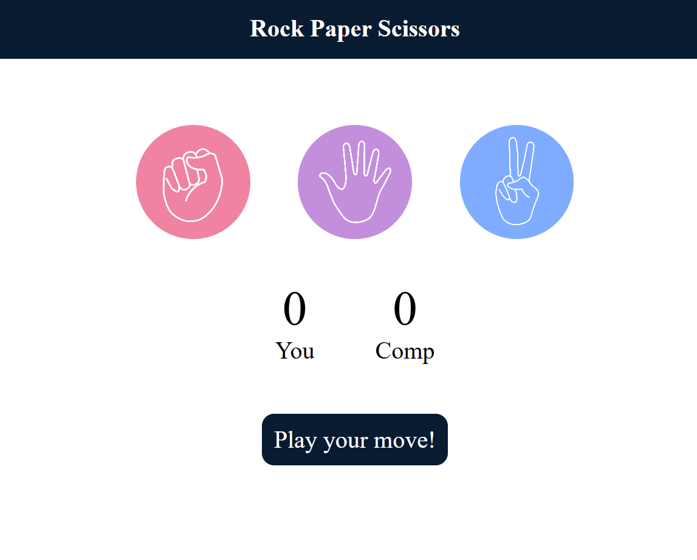

# ✊📄✂️ Rock Paper Scissors Game

> An interactive Rock Paper Scissors game built with HTML, CSS, and JavaScript where users compete against a computer opponent with real-time score tracking.

Rock Paper Scissors is a browser-based game that allows users to challenge a computer-generated opponent. The application uses random choice generation, dynamic score updates, and instant result feedback to create an engaging and interactive gaming experience.

## 🚀 Live Demo

🌐 Live Website: https://rock-paper-scissors-game-three-sigma.vercel.app

## 🔗 GitHub Repository

💻 GitHub: https://github.com/ayushraj78088/rock-paper-scissors-game

## 📸 Screenshots

### Game Interface



## ✨ Features

- ✊ Choose Rock
- 📄 Choose Paper
- ✂️ Choose Scissors
- 🤖 Computer-generated moves
- 🎲 Randomized game outcomes
- 🏆 Real-time score tracking
- 🟢 Win/Lose/Draw feedback
- ⚡ Instant game updates
- 📱 Responsive user interface

## 🛠️ Tech Stack

### Frontend

- HTML5
- CSS3
- JavaScript (ES6)

### Concepts Used

- DOM Manipulation
- Event Handling
- Random Number Generation
- Conditional Logic
- Score Management

## 📂 Project Structure

```bash
project/
│
├── index.html
├── style.css
├── script.js
├── rock.png
├── paper.png
├── scissors.png
└── rock-paper-scissors.png
```

## 💻 Running the Project Locally

### 1. Clone the Repository

```bash
git clone https://github.com/ayushraj78088/rock-paper-scissors-game
```

### 2. Navigate to the Project Folder

```bash
cd rock-paper-scissors-game
```

### 3. Open the Application

Simply open:

```bash
index.html
```

in your preferred browser.

## 🎯 Learning Outcomes

This project helped reinforce:

- JavaScript fundamentals
- DOM event handling
- Random number generation
- Game logic implementation
- Dynamic UI updates

---

⭐ If you enjoyed this project, consider giving it a star on GitHub!
